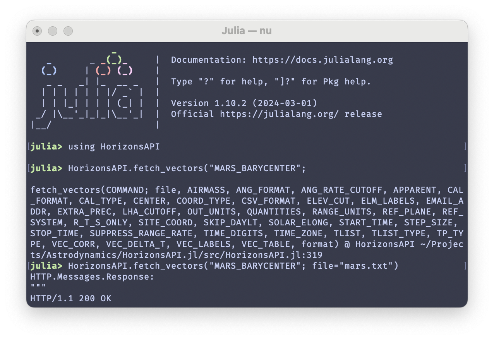

# Getting Started

The HORIZONS REST API accepts specific key-words for each type of command. Some
keywords are common to all commands, but most keywords are only valid for some
subset of available HORIZONS REST API commands. Thanks to Julia's
metaprogramming, and [helpful community](https://discourse.julialang.org/t/unpack-namedtuple-into-a-function-definition/97500/2),
these keyword arguments are specified precisely in the signature of each
`fetch_*` function. This allows users to simply press `TAB` in their chosen
tab-completion-supporting IDE, and view all options that are available for each
individual command.



## Examples

Take a look at each of the following examples for ideas about how to use the
HORIZONS REST API from within Julia.

### Fetch Cartesian State Data

```@example
using HorizonsAPI

fetch_vectors(
    399; # NAIF ID for Earth's center of mass
    START_TIME = "2024-01-01",
    STOP_TIME = "2025-01-01",
    STEP_SIZE = "1d", # one day
    CENTER = "@ssb", # solar system barycenter
)
```
