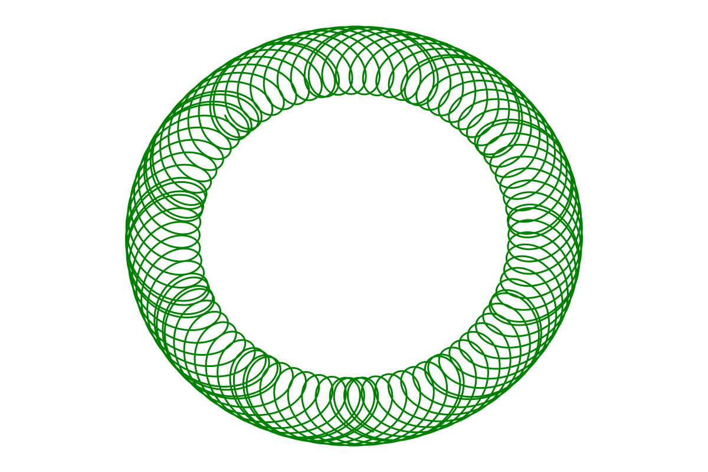

[](https://github.com/JuliaAstro/HorizonsEphemeris.jl/actions?query=workflow%3AUnitTests)
[](https://juliaastro.org/HorizonsEphemeris.jl)
[](https://github.com/SciML/SciMLStyle)

# `HorizonsEphemeris`

_A wrapper around the [wrapper](https://github.com/JuliaAstro/HorizonsAPI.jl) around
JPL's REST API for the Horizons solar system ephemeris platform!_

**Please consider all minor changes breaking until `v1.0`!**

> **Warning**
>
> This package is not affiliated with or endorsed by NASA, JPL, Caltech, or any
> other organization! This is an independently written package by an
> astrodynamics hobbyist.

## Installation

Choose one of the following two lines!

```julia
julia> ]add HorizonsEphemeris

julia> import Pkg; Pkg.add("HorizonsEphemeris");
```

## Limitations

Note that JPL Horizons ephemeris accuracy for major planetary bodies in the
solar system
[may have errors larger than 1000km](https://ssd.jpl.nasa.gov/horizons/manual.html#limits)
at some times!

## Usage

As of `v0.1`, only Cartesian vectors are supported. You can query the
`ephemeris` function with any solar system body name, or
[NAIF code](https://naif.jpl.nasa.gov/pub/naif/toolkit_docs/C/req/naif_ids.html);
`HorizonsEphemeris` uses [`SPICE`](https://github.com/JuliaAstro/SPICE.jl) under
the hood to return the appropriate Horizons-compatible NAIF code. After
providing the desired solar system body, specify the start time, stop time, and
step size for which you want ephemeris data. You'll receive a `NamedTuple` in
return. The labels for each key can be changed with the `header` keyword. For
example, to get rid of the Unicode character keys, specify
`header=[:MJD, :Calendar, :X, :Y, :Z, :DX, :DY, :DZ]`. This `NamedTuple` output
is automatically compatible with `DataFrames`. Finally, use the `file` keyword
argument to write the resulting ephemeris data, with labels, to a provided
filename as a CSV file.

```julia
julia> using Plots, Dates, HorizonsEphemeris

julia> earth = let start = now() - Year(50), stop = now() + Year(50), step = Day(1)
           @time ephemeris("earth", start, stop, step; wrt="jupiter", units="AU-D");
       end
  # 6.376672 seconds (19.78 k allocations: 21.253 MiB)

julia> plot(
           earth.x, earth.y;
           aspect_ratio = 1,
           linewidth = 1.5,
           border = :none,
           size = (600, 600),
           dpi = 200,
           grid = false,
           axis = nothing,
           title = "",
           label=:none,
           color = "green",
           background=:transparent,
       )
```


